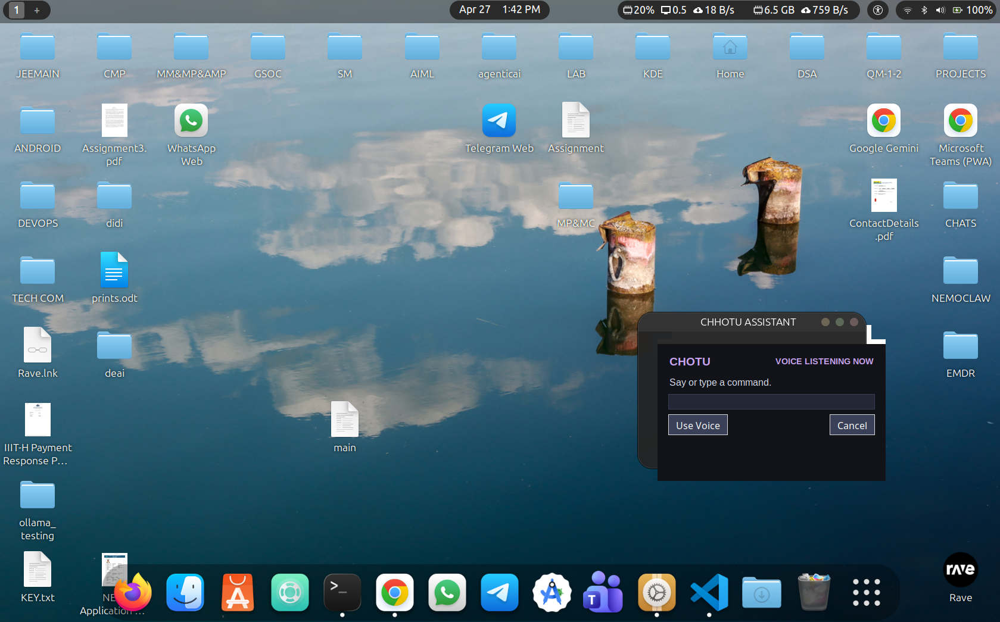

# Chotu Voice Assistant



A voice assistant that listens for wake words ("chhotu", "chotu") and executes commands via OpenCLAW.

## Features

- Wake word detection using speech recognition
- Voice and typing input modes
- Tkinter-based popup UI
- Keyboard shortcut: Hold Alt for 1+ seconds to invoke
- Autostart support for Linux

## Prerequisites

- Python 3.12+
- OpenCLAW binary (set via environment variable)
- ALSA audio libraries (Linux)

## Setup

```bash
# Clone the repository
git clone <your-repo-url>
cd chootu_personal_assistant

# Create virtual environment
python3 -m venv venv

# Activate virtual environment
source venv/bin/activate

# Install dependencies
pip install -r requirements.txt
```

### Environment Variables

Set these before running:

- `OPENCLAW_BIN` - Path to OpenCLAW binary (default: `~/.nvm/versions/node/v24.14.0/bin/openclaw`)
- `HOME` - Your home directory (auto-detected)

Example:
```bash
export OPENCLAW_BIN="$HOME/.nvm/versions/node/v24.14.0/bin/openclaw"
```

### Desktop Entry Setup

Edit `chotu.desktop` and replace the path:
```ini
Exec=/path/to/your/INSTALL_DIR/run_chotu.sh
```
Replace `/path/to/your/INSTALL_DIR` with your actual installation path.

### Autostart (Linux)

```bash
# Install autostart entry
./install_autostart.sh
```

## Run

```bash
python voice_assistant.py
# Or use the launcher
./run_chotu.sh
```

## Usage

- Say "chhotu" or "chotu" followed by your command
- Or hold Alt key for 1+ seconds to invoke typing mode
- Type command and press Enter, or click "Use Voice" to switch to voice